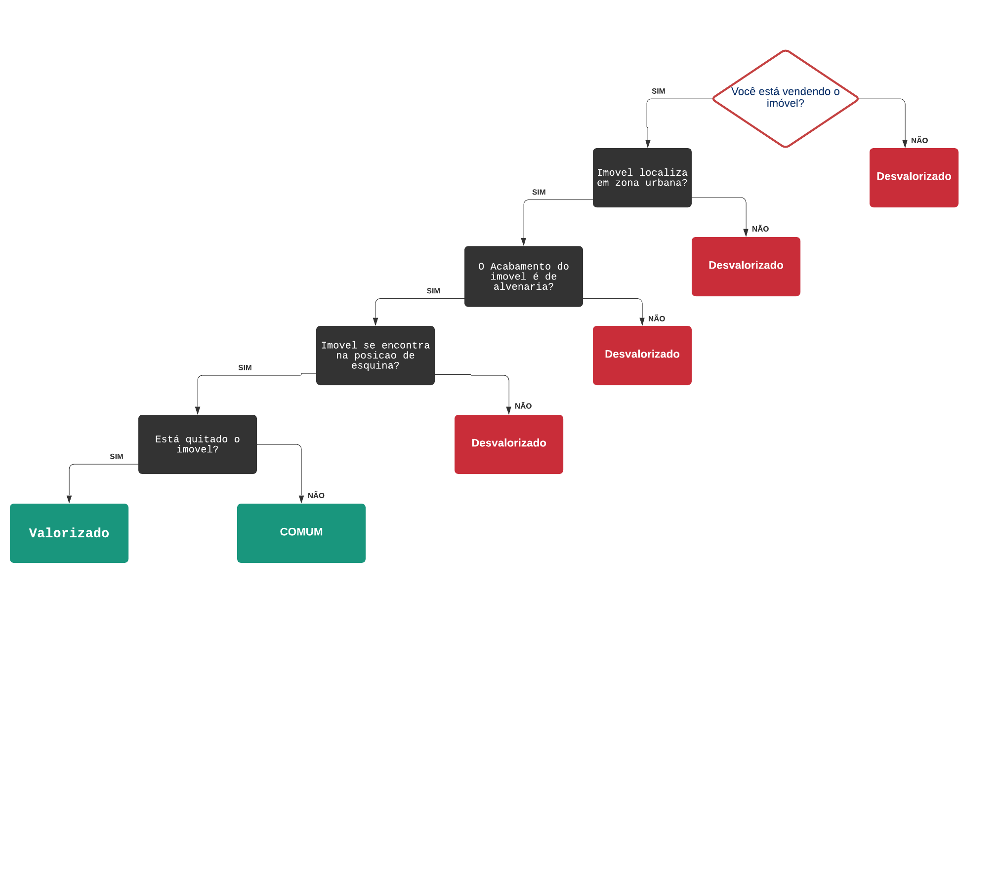

# SISTEMAS ESPECIALISTA (AVALIAÇÃO DE IMÓVEIS)

Você sabe como fazer uma boa Avaliação Imobiliária?

Você tem um imóvel que gostaria de colocar à venda, mas o tempo passou e muita coisa mudou: a moeda é outra, o bairro tem uma infraestrutura melhor desde quando você adquiriu o apartamento, muita coisa aconteceu, o que tornou a área mais valorizada. O preço então que você pagou há 25 anos, definitivamente não é mais o mesmo que o imóvel vale.

Para não errar na hora de calcular o preço e não correr o risco de perder tempo e dinheiro, é preciso saber bem por quanto vender. Será necessário então, fazer uma avaliação técnica do seu imóvel, afinal das contas, você deve vender seu imóvel com o preço compatível com o mercado.

Avaliação de Imóveis, nada mais é do que uma análise a fim de estimar o valor do imóvel de maneira técnica. A avaliação se aplica a todo tipo de imóvel, sendo ele rural, urbano, residencial ou industrial para venda ou aluguel.

Ela também é importante para casos em que é necessária a partilha de heranças, o financiamento hipotecário, cálculo de indenização por expropriação ou determinação de valor para fins fiscais.

Alguns dos critérios usados na Avaliação de Imóveis são:

- Localização;  
- Acabamento do imóvel; 
- Posicionamento na quadra (esquina, meio de quadra, de frente ou de fundos); 
- Documentação. 

## Rede Semantica para implementação da lógica. 

A principio a rede semântica do algoritmo que compõe por três variaveis: Comum, valorizada e desvalorizado. Com isso podemos observar que o algoritmo segue um linha de perguntas para o usuario, afim de ver a qualidade do imovel.

